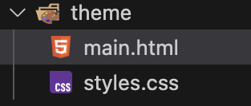
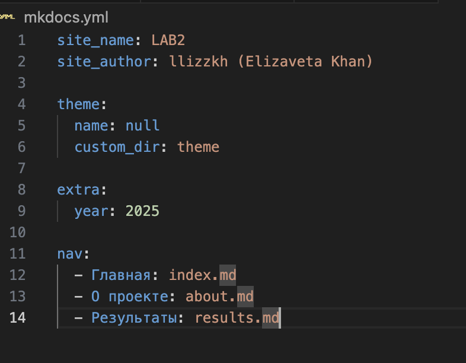
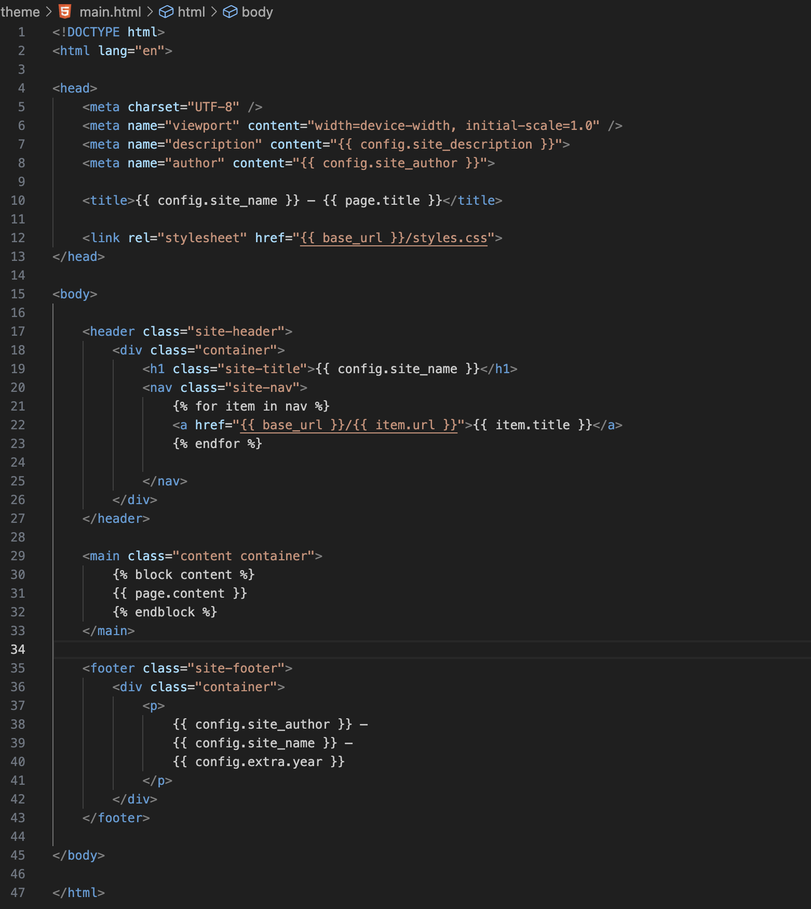
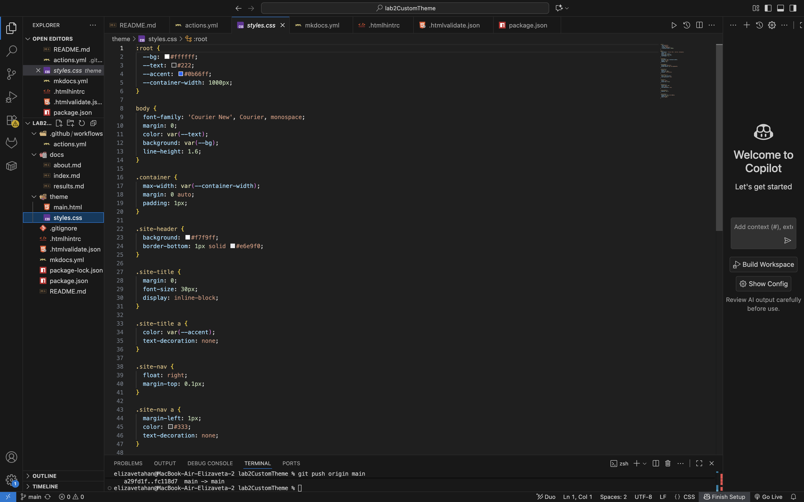
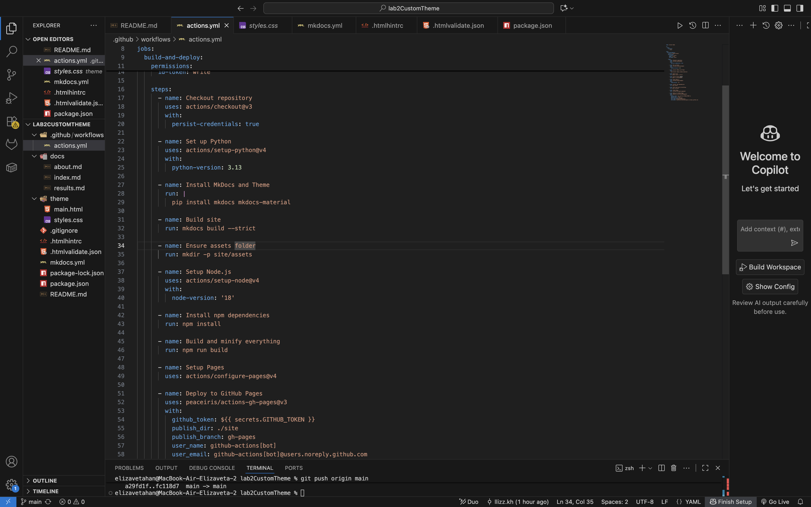
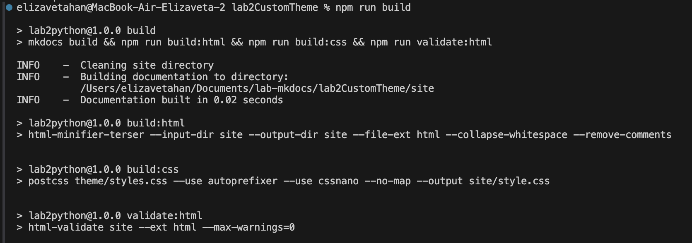
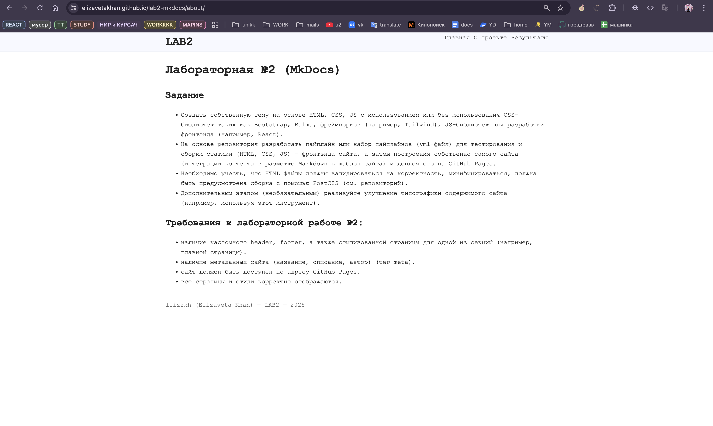

# lab2-mkdocs

## Описание выполнения работы

1. Создание папки theme с файлами html и css

2. Настройка MkDocs на использование кастомной темы

3. Разработка шаблона main.html с футером, хэдером, контентом и использованием Jinja-переменных

4. Настройка стилей

5. Формирование пайплайна для публикации на gh-pages

6. Сборка и локальная проверка

7. Публикация на gh-pages

